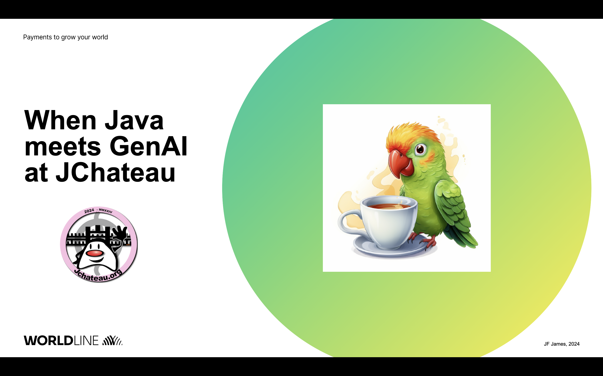

# quarkus-langchain4j experimentation

This project is an experimentation of the  https://docs.quarkiverse.io/quarkus-langchain4j/dev/index.html[quarksu-langchain4j] extension. It aims at studying how to leverage LLMs (impressive) capabilities in Java applications.

I've used it to illustrate my talk at https://www.jchateau.org[Chateau 2024 unconference].

It is based on a simplified car booking application inspired from the https://www.youtube.com/watch?v=BD1MSLbs9KE[Java meets AI] talk from Liz Raes at Devoxx Belgium 2023. The car booking company is called "Miles of Smiles" and the application exposes two AI services:

. a chat service to freely discuss with a customer assistant
. a fraud service to determine if a customer is a frauder.

For the sake of simplicity, there is no database interaction, the application is standalone and can be used "as is". Of course thanks to Quarkus, it can  easily be extended according to your needs.

Warning: you must first configure the application to connect to an LLM that supports Function Calling (see Environment Variables below).

The application works in command mode with a @QuarkusMain class (see CustomerSupportMain class). For more information see https://quarkus.io/guides/command-mode-reference[Quarkus Command mode application].

When the application is launched, interaction is done from the keyboard (User message prompt):

* enter __bye__ to exit
* enter __fraud <name> <surname>__ to detect a fraud for a customer
* any other text is considered as a request for the bot.

## Technical context

The project has been developped and tested with:

. Java 21.0.2 (Temurin OpenJDK distro)
. GraalVM CE 21.0.2
. Maven 3.9.5
. Testing against GPT 3.5 and 4.0 on a dedicated Azure instance (to be customized according to your context).

## Environment variables (configuration)

The following environment variables have been set up to run the application and must be customized according to your environment (can also be defined in application.properties):

* QUARKUS_LANGCHAIN4J_AZURE_OPENAI_API_KEY
* QUARKUS_LANGCHAIN4J_AZURE_OPENAI_ENDPOINT
* QUARKUS_LANGCHAIN4J_AZURE_OPENAI_RESOURCE_NAME
* QUARKUS_LANGCHAIN4J_AZURE_OPENAI_DEPLOYMENT_NAME
* QUARKUS_LANGCHAIN4J_AZURE_OPENAI_API_VERSION

Other parameters are defined in application.properties.

For a detailed description see https://docs.quarkiverse.io/quarkus-langchain4j/dev/openai.html[Quarkus langchain4j OpenAI documentation].

## Packaging the application

To package in JVM mode: __mvn package__

To package in native mode: __mvn package -Pnative -DskipTests__

## Running the application

To run in dev mode :

* with quarkus command: _quarkus dev_
* with Maven: __mvn quarkus:dev__

To run tests: __mvn test__.

To run in JVM mode: __java -jar target/quarkus-app/quarkus-run.jar__

To run in native mode: _./target/car-booking-1.0-runner_

## Programming model

There are two AI interfaces (annotated with @RegisterAiService):

. ChatAiService: to chat with a "Miles of Smiles" customer support
. FraudAiService: to detect if a customer is a frauder.

There are two important features, when it comes to use LLMs in applications:

. RAG (Retrieval Augmented Generation)
. Function Calling.

Let's investigate them...

## RAG

RAG consists in augmenting the LLM with specific knowledge coming from different data sources: text, PDF, CSV ....

Documents must first be ingested: their content is turned into a vectorial representation (using a local model) and stored in a vector database (in memory, pgsql, Croma etc ...). This process is usually done in batch mode.

Upon each request, text segments are selected and appended to the user message according to their semantic proximity with the request.

In this project:

* 4 text documents are ingested (in docs-for-rag directory). One of them is a an apple pie recipe which has nothing to do with car booking, it is interesting to test the retrieval selectivity
* Ingestion is performed at application startup (see DocRagIngestor class)
* Retrieval is configured on ChatAiService (see retrievalAugmentor parameter on @RegisterAiService annotation), not on  FraudAiService
* Retrieval is done upon each request (see DocRagAugmentor class)
* __AllMiniLmL6V2QuantizedEmbeddingModel__ is a "small" model used for local embedding (ingestion). Quantization is a technique to reduce the size (and the accuracy) of a model allowing it to be run using less powerful hardware.

A key parameter to optimize segment retrieval is MIN_SCORE when building the EmbeddingStoreContentStoreRetriever:
[source, java]
----
// From 0 (low selectivity) to 1 (high selectivity)
private static final double MIN_SCORE = 0.6;

// Other code

// retriever build
this.retriever = EmbeddingStoreContentRetriever.builder()
                            .embeddingModel(model)
                            .embeddingStore(store)
                            .maxResults(MAX_RESULTS)
                            .minScore(MIN_SCORE)
                            .build();
----

During my tests, it appears that the default value (0.5) is not selective enough, the apple pie recipe being systematically selected whatever the user question is. Setting it to 0.6 has provided more relevant results.

## Function calling

Function calling consists in asking the LLM to call our business logic... which is both powerful and dangerous! It is not supported by all models. Reminder: this project has been tested with Azure OpenAI 3.5/4.0.

### Declaring callable functions

With quarkus-langchain4j, a callable function is a Java method annotated with @Tool:
[source, java]
----
@Tool("Get booking details for booking number {bookingNumber} and customer {name} {surname}")
public Booking getBookingDetails(String bookingNumber, String name, String surname) { ... }
----

That example uses Qute templating to parameterize the user query.

Each class implementing such callable functions must be declared in the @RegisterAiService annotation:
[source, java]
----
@RegisterAiService(tools = BookingService.class)
public interface CustomerSupportAgent { ... }
----

In this project, all called functions are implemented by BookingService.

But how does it work under the hood?

### Request

At runtime, a JSON descriptor of each callable function is added to the request:
[source,json]
----
{
   "name":"getBookingDetails",
   "description":"Get booking details for booking number {bookingNumber} and customer {name} {surname}",
   "parameters":{
      "type":"object",
      "properties":{
         "surname":{
            "type":"string"
         },
         "name":{
            "type":"string"
         },
         "bookingNumber":{
            "type":"string"
         }
      },
      "required":[
         "bookingNumber",
         "name",
         "surname"
      ]
----

### Response
If the LLM decides to call a function, it answers by describing how to call it:
[source,json]
----
"choices":[
   {
      "finish_reason":"function_call",
      "index":0,
      "message":{
         "role":"assistant",
         "content":null,
         "function_call":{
            "name":"getBookingsForCustomer",
            "arguments":"{\"surname\":\"Bond\",\"name\":\"James\"}"
         }
      },
      "content_filter_results":{
         
      }
   }
]
----

This process can be very slow, a single user message can lead to multiple LLM round-trips.

Parallel function calling seems possible with OpenAI (see https://platform.openai.com/docs/guides/function-calling[OpenAI function calling doc]) but I have not tested it yet.

### Effective function calling

Of course, the LLM can't call the function on its own. This is the responsibility of quarkus-langchain4j to turn the LLM response into a local function call.

Due to the non-deterministic nature of the LLM, functions calling must be used with care, especially for critical business logic: payment, cancelation ...

To influence the behavior of the LLM, it is recommended to set the temperature and top priority in the configuration:
[source,property]
----
# Set the model temperature for deterministic responses
quarkus.langchain4j.azure-openai.chat-model.temperature=0.1
# An alternative (or a complement?) to temperature: 0.1 means only top 10% probable tokens are considered
quarkus.langchain4j.azure-openai.chat-model.top-p=0.1
----

## Playing with the application

To test the application, you can enter the following user messages (see ChatAiServiceTest and FraudAiServiceTest to get some inspiration):

* Hello, how can you help me?
* What is your list of cars?
* What is your cancelation policy?
* What is your fleet size? Be short please.
* How many electric cars do you have?
* My name is James Bond, please list my bookings
* Is my booking 123-456 cancelable?
* Is my booking 234-567 cancelable?
* Can you check the duration please?
* I'm James Bond, can I cancel all my booking 345-678?
* Can you provide the details of all my bookings?
* fraud James Bond
* fraud Emilio Largo

To understand the dynamic of the application, some key log messages are prefixed by DEMO.

## Feedback

The application has been tested with Azure OpenAI 3.5 and 4.0.

In my context, OpenAI 3.5 has proved to be much faster while providing sufficiently consistent answers in most cases.

The LLM behavior regarding booking cancelation has been the less consistent during my tests. Even by knowing the cancelation policy (provided in an embedding document), it doesn't hesitate to depart from it claiming that a reservation is cancelable when it is not or even trying to cancel it directly.  It can probably be improved with an https://docs.quarkiverse.io/quarkus-langchain4j/dev/prompt-engineering.html[improved prompt engineering technique]. 

Last but not least, keep in mind that LLMs do not hesitate to invent responses. For instance, when you ask for diesel or SUV, although it has not the information, the LLM doesn't hesitate to answer positively.

## Next steps

To be investigated:

* Testability
* Observability
* Fault tolerance
* Auditability
* Parallel function calling
* Production readiness.